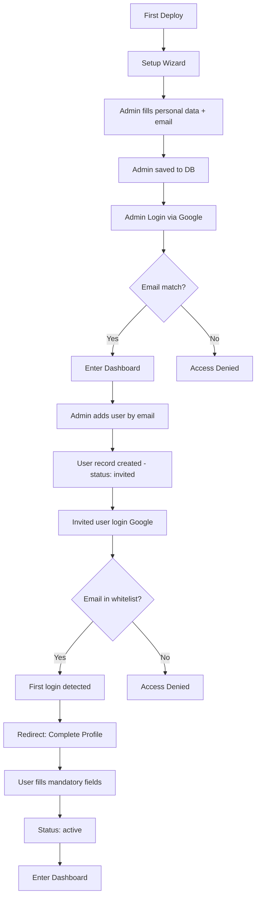

# Authentication & User Flow

> Authentication and user management concepts for ATechAsync Engine.

---

## Overview

ATechAsync uses **whitelist-based authentication**:
- Only emails registered in the database can login
- Admin adds users via email invitation
- Users must complete their profile after first login

---

## User & Auth Flow



---

## User Status

| Status | Description |
|--------|-------------|
| `setup` | First admin, created during setup wizard |
| `invited` | User added by admin, never logged in |
| `pending` | Logged in, but profile not completed |
| `active` | Profile complete, can access dashboard |
| `suspended` | Deactivated by admin |

---

## Role Permissions

| Role | Dashboard | Create Post | Publish | Manage Users | Settings |
|------|-----------|-------------|---------|--------------|----------|
| `admin` | ✅ | ✅ | ✅ | ✅ | ✅ |
| `author` | ✅ | ✅ | ❌ (draft only) | ❌ | ❌ |

---

## Setup Wizard Flow (First Deploy)

1. Detect: No users in DB → redirect to `/setup`
2. Admin fills:
   - Email (becomes first whitelist entry)
   - Name
   - Display Name
   - Site Title & Description
3. Submit → Insert user with `role: admin`, `status: setup`
4. Redirect to login → Google OAuth
5. Email match → status becomes `active`

---

## Add User Flow (Admin)

1. Admin opens Users menu → Add User
2. Input: Email, Role
3. Submit → Insert user with:
   - `status: invited`
   - `invitedBy: currentUser.id`
   - `invitedAt: now()`
4. (Optional) Send email notification

---

## First Login Flow (Invited User)

1. User accesses site → Login with Google
2. Auth.js callback: check if email exists in `users` table
3. If exists and `status === 'invited'`:
   - Update `status: pending`
   - Redirect to `/complete-profile`
4. User fills mandatory fields (name, displayName)
5. Submit → Update `status: active`
6. Redirect to dashboard

---

## Profile Fields

### Mandatory (required after first login)

| Field | Validation |
|-------|------------|
| `name` | Min 2 characters |
| `displayName` | Min 2 characters, displayed on posts |

### Optional (can be updated from Profile menu)

| Field | Description |
|-------|-------------|
| `bio` | Short biography |
| `image` | Custom avatar (overrides Google) |
| Social links | Twitter, GitHub, etc (via user_meta) |

---

## Auth.js Configuration

### Whitelist Strategy

Only emails that exist in `users` table can login.

### Callbacks

```
signIn callback:
  1. Check if email exists in users table
  2. If not exists → return false (deny)
  3. If exists and status === 'suspended' → return false
  4. If exists → return true (allow)
  5. Update lastLoginAt

session callback:
  1. Inject user.role into session
  2. Inject user.status into session
  3. Client can check session.user.status for redirect

redirect callback:
  1. If user.status === 'pending' → /complete-profile
  2. If user.status === 'active' → /admin/dashboard
```

---

## Middleware Protection

| Route | Condition |
|-------|-----------|
| `/setup` | Only if no users in DB |
| `/login` | Public |
| `/complete-profile` | Only if `status === 'pending'` |
| `/admin/*` | Only if `status === 'active'` |

---

> 📝 **Database Schema:** See [database-schema.md](./database-schema.md) for database column details
