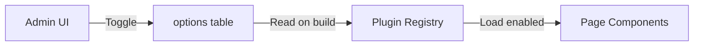

# Core Architecture Detail Plan

> Detailed specifications for the three core architectural components of ATechAsync Engine.

---

## A. The Classic Editor (Admin)

### Engine: Tiptap (Free Edition)

**Why Tiptap?**
- Headless WYSIWYG editor built on ProseMirror
- Framework agnostic with excellent React support
- JSON output format (vs raw HTML) for security & flexibility
- Tree-shakeable extensions

### Fixed Toolbar Design

```
┌─────────────────────────────────────────────────────────────────────────────┐
│ [B] [I] [U] [S] │ [H1] [H2] [H3] [¶] │ [•] [1.] │ [❝] [</>] [—] │ [🔗] [🖼] │
└─────────────────────────────────────────────────────────────────────────────┘
│                                                                             │
│                         Editor Content Area                                 │
│                                                                             │
│                                                                             │
└─────────────────────────────────────────────────────────────────────────────┘
```

### Toolbar Button Groups

| Group | Buttons | Extensions Required |
|-------|---------|---------------------|
| **Text Format** | Bold, Italic, Underline, Strike | `@tiptap/starter-kit`, `@tiptap/extension-underline` |
| **Headings** | H1, H2, H3, Paragraph | `@tiptap/starter-kit` |
| **Lists** | Bullet, Ordered | `@tiptap/starter-kit` |
| **Blocks** | Blockquote, Code Block, HR | `@tiptap/starter-kit` |
| **Media** | Link, Image | `@tiptap/extension-link`, `@tiptap/extension-image` |

### Editor Component Structure

```
src/components/editor/
├── TiptapEditor.tsx          # Main editor wrapper
├── EditorToolbar.tsx         # Fixed top toolbar
├── FeaturedImagePicker.tsx   # Featured image/thumbnail selector
├── toolbar/
│   ├── FormatButtons.tsx     # Bold, Italic, etc.
│   ├── HeadingButtons.tsx    # H1, H2, H3, P
│   ├── ListButtons.tsx       # Bullet, Numbered
│   ├── BlockButtons.tsx      # Quote, Code, HR
│   └── MediaButtons.tsx      # Link, Image trigger
├── ImageModal.tsx            # Hybrid image picker
└── LinkModal.tsx             # Link editor modal
```

### Featured Image / Thumbnail Picker

Component for selecting featured image displayed in listings and social share.

```
┌─────────────────────────────────────────────────────────────────┐
│  FEATURED IMAGE                                                 │
├─────────────────────────────────────────────────────────────────┤
│                                                                 │
│   ┌─────────────────────────────────────┐                       │
│   │                                     │                       │
│   │   🖼️  Click to set featured image   │  [Remove]            │
│   │                                     │                       │
│   └─────────────────────────────────────┘                       │
│                                                                 │
│   Recommended: 1200x630px (OG Image ratio)                      │
└─────────────────────────────────────────────────────────────────┘
```

**Features:**
- Click to open ImageModal (same hybrid picker)
- Preview with aspect ratio 1200x630 (Open Graph)
- Remove button to clear featured image
- Auto-generate thumbnail sizes via Vercel Image Optimization

**Thumbnail Sizes:**
| Size | Dimensions | Usage |
|------|------------|-------|
| `og` | 1200×630 | Open Graph / Social Share |
| `card` | 400×210 | Post cards on listing |
| `thumb` | 150×80 | Admin table / compact list |

> 📝 **Implementation:** See [phase-2-editing-engine.md](./phase-2-editing-engine.md)

### Tiptap Configuration

```typescript
// Extensions to install
const extensions = [
  StarterKit.configure({
    heading: { levels: [1, 2, 3] },
    codeBlock: { HTMLAttributes: { class: 'code-block' } },
  }),
  Underline,
  Link.configure({
    openOnClick: false,
    HTMLAttributes: { rel: 'noopener noreferrer' },
  }),
  Image.configure({
    inline: false,
    allowBase64: false, // Force URL-only
  }),
  Placeholder.configure({
    placeholder: 'Start writing your article...',
  }),
];
```

---

## B. Hybrid Image Modal

### Two-Tab Interface

#### Tab 1: Upload to Vercel Blob
```
┌─────────────────────────────────────────┐
│ [Upload] [External URL]                 │
├─────────────────────────────────────────┤
│  ┌─────────────────────────────────┐    │
│  │                                 │    │
│  │  📁 Drag & drop or click to    │    │
│  │     select image               │    │
│  │                                 │    │
│  │  Max 4.5MB • JPG, PNG, WebP    │    │
│  └─────────────────────────────────┘    │
│                                         │
│  Alt text: [____________________]       │
│                                         │
│        [Cancel]  [Upload & Insert]      │
└─────────────────────────────────────────┘
```

**Upload Flow:**
1. User selects/drops image
2. Show preview with loading indicator
3. POST to `/api/upload` → Vercel Blob
4. Receive URL → Insert into editor
5. Store in `posts.content` JSON

**Constraints:**
- Max file size: 4.5MB (Vercel limit)
- Allowed types: JPEG, PNG, WebP, GIF
- Total Blob storage: 250MB (free tier)

#### Tab 2: External URL

```
┌─────────────────────────────────────────┐
│ [Upload] [External URL]                 │
├─────────────────────────────────────────┤
│                                         │
│  Image URL:                             │
│  [https://...                      ]    │
│                                         │
│  ┌─────────────────────────────────┐    │
│  │       Preview appears here      │    │
│  └─────────────────────────────────┘    │
│                                         │
│  Alt text: [____________________]       │
│                                         │
│        [Cancel]  [Insert Image]         │
└─────────────────────────────────────────┘
```

**Supported External Sources:**
| Source | URL Pattern | Use Case |
|--------|-------------|----------|
| GitHub Issues | `user-images.githubusercontent.com/*` | Screenshots, memes |
| Pexels | `images.pexels.com/*` | Stock photos |
| Unsplash | `images.unsplash.com/*` | Stock photos |
| Any HTTPS | `https://*` | General external |

**Validation:**
- Must be HTTPS
- Must be valid image URL (check Content-Type header)
- Show preview before inserting

---

## C. Theme & Layout System (Public)

### Registry Pattern

Layouts are defined by **folder structure**, not database config:

```
src/app/(public)/
├── layout.tsx                 # Shared wrapper (header, footer)
├── page.tsx                   # Home Layout
├── search/
│   └── page.tsx              # Search/List Layout
├── blog/
│   └── [slug]/
│       └── page.tsx          # Detail Layout
├── [slug]/                    # Static pages (about, contact)
│   └── page.tsx
└── not-found.tsx             # 404 page
```

### AI-Driven Template Designer

> Convert HTML mockups to React components using AI agents in IDE.
> 📝 **Implementation:** See [phase-3-public-rendering.md](./phase-3-public-rendering.md#311-ai-driven-template-designer)

#### Directory Structure (To Create)

```
src/themes/designer/
├── DESIGNER.md          # AI prompt & workflow instructions
├── _input/              # Paste raw HTML mockups + assets here
│   ├── home/
│   │   ├── index.html
│   │   ├── style.css
│   │   └── images/
│   ├── post-detail/
│   │   ├── index.html
│   │   └── style.css
│   └── post-list/
│       ├── index.html
│       └── style.css
└── _output/             # AI-generated React components
    ├── HomeLayout.tsx
    ├── PostDetail.tsx
    └── PostList.tsx
```

#### Workflow

1. **Input:** Paste HTML mockup (with CSS) into `_input/` folder
2. **Prompt:** Use DESIGNER.md prompt template to guide AI agent
3. **Output:** AI generates React Server Component in `_output/`
4. **Review:** Test component locally
5. **Deploy:** Move to `src/components/public/` when ready

#### DESIGNER.md Contents (To Create)

The DESIGNER.md file should contain:

1. **AI Prompt Template** - Standardized prompt for HTML → React conversion
2. **Conversion Rules:**
   - Use Next.js 15 App Router (React Server Components)
   - Convert CSS to Tailwind utilities
   - Use `next/image` for images
   - Use `next/link` for internal links
   - Define TypeScript interfaces for props
   - Add JSDoc comments
3. **Layout Type Specs** - Expected interfaces for Home, PostDetail, PostList
4. **Integration Steps** - How to use generated components
5. **Example** - Before/after HTML → React

#### AI Prompt Template

```markdown
### CONTEXT
I have an HTML mockup in `src/themes/designer/_input/{filename}.html`.
This is for ATechAsync CMS - a Next.js 15 serverless CMS.

### TASK
Convert this HTML to a React Server Component:
1. Framework: Next.js 15 App Router
2. Styling: Tailwind CSS (convert from CSS)
3. Images: next/image
4. Links: next/link
5. Types: TypeScript interfaces

### OUTPUT
Save to `src/themes/designer/_output/{ComponentName}.tsx`
```

#### Benefits

- ✅ Rapid prototyping from any HTML template
- ✅ Consistent component structure
- ✅ Automatic Tailwind conversion
- ✅ TypeScript interfaces generated
- ✅ Works with any AI agent (Gemini, Claude, GPT)

### Layout Specifications

#### 1. Home Layout (`page.tsx`)

```
┌─────────────────────────────────────────────────────────────┐
│                        HEADER                               │
├─────────────────────────────────────────────────────────────┤
│                                                             │
│   ┌─────────────────────────────────────────────────────┐   │
│   │              HERO SECTION                           │   │
│   │   Site Title / Tagline / CTA                        │   │
│   └─────────────────────────────────────────────────────┘   │
│                                                             │
│   FEATURED POSTS                                            │
│   ┌─────────┐  ┌─────────┐  ┌─────────┐                    │
│   │  Card   │  │  Card   │  │  Card   │                    │
│   │         │  │         │  │         │                    │
│   └─────────┘  └─────────┘  └─────────┘                    │
│                                                             │
│   RECENT POSTS                                              │
│   ├── Post title — date                                    │
│   ├── Post title — date                                    │
│   └── Post title — date                                    │
│                                                             │
├─────────────────────────────────────────────────────────────┤
│                        FOOTER                               │
└─────────────────────────────────────────────────────────────┘
```

**Components:**
- `HeroSection` - Full-width banner with gradient
- `PostGrid` - 3-column responsive grid
- `PostCard` - Image, title, excerpt, date
- `RecentList` - Compact vertical list

#### 2. Search/List Layout (`search/page.tsx`)

```
┌─────────────────────────────────────────────────────────────┐
│                        HEADER                               │
├─────────────────────────────────────────────────────────────┤
│                                                             │
│   🔍 [Search input________________________] [Search]        │
│                                                             │
│   Showing 24 results for "keyword"                          │
│                                                             │
│   ┌─────────────────────────────────────────────────────┐   │
│   │ 🖼  Post Title                                       │   │
│   │     Excerpt text preview...              Jan 2026   │   │
│   ├─────────────────────────────────────────────────────┤   │
│   │ 🖼  Post Title                                       │   │
│   │     Excerpt text preview...              Jan 2026   │   │
│   └─────────────────────────────────────────────────────┘   │
│                                                             │
│   [← Prev]  Page 1 of 3  [Next →]                          │
│                                                             │
├─────────────────────────────────────────────────────────────┤
│                        FOOTER                               │
└─────────────────────────────────────────────────────────────┘
```

**Features:**
- URL-based search: `/search?q=keyword&page=2`
- Server-side search with PostgreSQL full-text
- 10 posts per page
- Minimalist vertical archive style

#### 3. Detail Layout (`blog/[slug]/page.tsx`)

```
┌─────────────────────────────────────────────────────────────┐
│                        HEADER                               │
├─────────────────────────────────────────────────────────────┤
│                                                             │
│         ┌───────────────────────────────────┐               │
│         │       Featured Image              │               │
│         │       (Full Width)                │               │
│         └───────────────────────────────────┘               │
│                                                             │
│                   ARTICLE TITLE                              │
│         By Author Name • January 15, 2026                   │
│                                                             │
│         ─────────────────────────────────────               │
│                                                             │
│         Article content with optimal                        │
│         typography for reading. Max-width                   │
│         ~65ch for comfortable reading.                      │
│                                                             │
│         Images, quotes, code blocks...                      │
│                                                             │
│         ─────────────────────────────────────               │
│                                                             │
│         [Share: Twitter | Facebook | Copy]                  │
│                                                             │
│         RELATED POSTS                                       │
│         ┌────┐ ┌────┐ ┌────┐                               │
│         └────┘ └────┘ └────┘                               │
│                                                             │
├─────────────────────────────────────────────────────────────┤
│                        FOOTER                               │
└─────────────────────────────────────────────────────────────┘
```

**Typography:**
- Body: 18px, line-height 1.7
- Max-width: 65ch (~680px)
- Headings: 1.2-2x body size
- Code: Monospace with syntax highlight

---

## D. Plugin System (Hybrid)

### Architecture Overview

```
src/plugins/
├── types.ts                  # Plugin interfaces
├── registry.ts               # Plugin loader
├── mu/                       # Must-Use (always active)
│   ├── index.ts             # MU plugin exports
│   ├── seo-metadata.ts
│   ├── security-headers.ts
│   └── analytics.ts
└── optional/                 # Toggleable via DB
    ├── index.ts             # Optional plugin exports
    ├── social-share.tsx
    └── newsletter.tsx
```

### Plugin Interface

```typescript
// src/plugins/types.ts
export interface BasePlugin {
  id: string;
  name: string;
  description: string;
  version: string;
}

export interface MUPlugin extends BasePlugin {
  type: 'mu';
  priority: number;                    // Lower = runs first
  onBuild?: () => Promise<void>;       // Build-time hook
  onRequest?: (req: Request) => void;  // Request-time hook
  injectHead?: () => React.ReactNode;  // <head> injection
  injectBody?: () => React.ReactNode;  // <body> injection
}

export interface OptionalPlugin extends BasePlugin {
  type: 'optional';
  enabled: boolean;
  settings?: Record<string, unknown>;
  Component?: React.FC;                 // UI Component
}
```

### MU Plugins (Built-in)

| Plugin | Purpose | Injection Point |
|--------|---------|-----------------|
| `seo-metadata` | Generate meta tags, JSON-LD | `<head>` |
| `security-headers` | CSP, HSTS, X-Frame | `next.config.js` |
| `analytics` | Vercel Analytics | `<body>` end |

### Optional Plugins (Toggle via Admin)

| Plugin | Purpose | Storage |
|--------|---------|---------|
| `social-share` | Share buttons on posts | `options` table |
| `newsletter` | Email subscription form | `options` table |
| `comments` | Comment system | Future |

### Plugin Management Flow



---

## Files to Create

| File | Purpose |
|------|---------|
| `src/components/editor/TiptapEditor.tsx` | Main editor |
| `src/components/editor/EditorToolbar.tsx` | Fixed toolbar |
| `src/components/editor/ImageModal.tsx` | Hybrid image modal |
| `src/components/editor/LinkModal.tsx` | Link editor |
| `src/plugins/types.ts` | Plugin type definitions |
| `src/plugins/registry.ts` | Plugin loader |
| `src/app/(public)/layout.tsx` | Public layout |
| `src/app/(public)/page.tsx` | Home page |
| `src/app/(public)/search/page.tsx` | Search page |
| `src/app/(public)/blog/[slug]/page.tsx` | Post detail |
