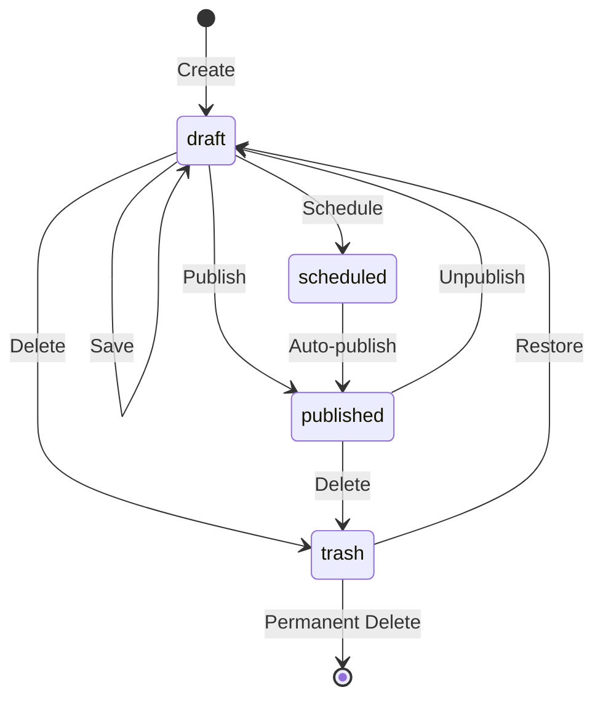
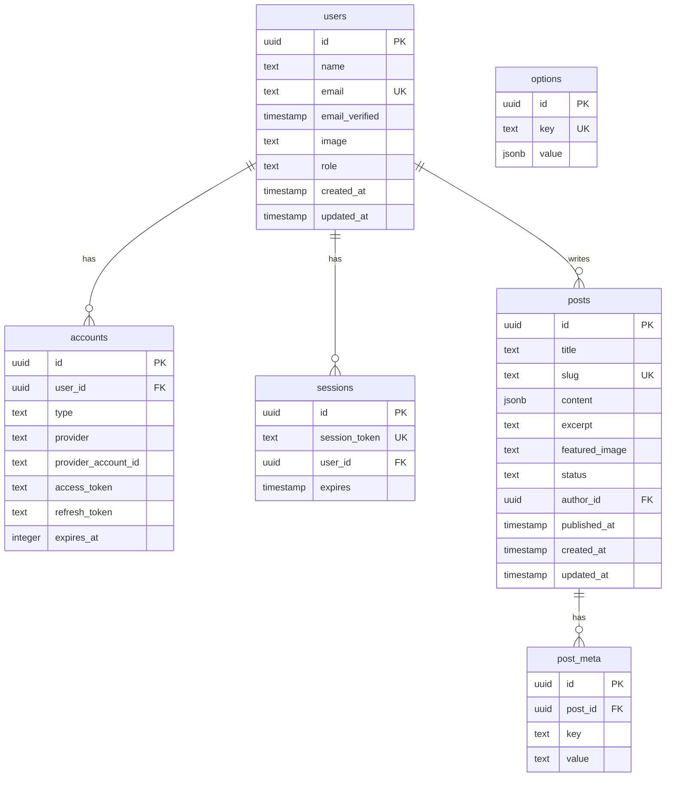

# Database Schema Detail Plan

> Complete Drizzle ORM schema definitions for ATechAsync Engine with Neon PostgreSQL.

---

## Overview

| Table | Purpose | Relations |
|-------|---------|-----------|
| `users` | Authentication & roles | → accounts, sessions, posts |
| `accounts` | OAuth provider data | → users |
| `sessions` | Active sessions | → users |
| `verification_tokens` | Email verification | — |
| `posts` | Content storage | → users, post_meta |
| `post_meta` | Extensible key-value data | → posts |
| `options` | Global site settings | — |

---

## 1. Users Table

> 📄 **Flow & Concept:** See [auth-flow.md](./auth-flow.md) for authentication flow details

### Schema

| Column | Type | Required | Description |
|--------|------|----------|-------------|
| `id` | uuid | ✅ | Primary key |
| `email` | text | ✅ | Unique, whitelist key |
| `name` | text | ⭕ | Mandatory after login |
| `displayName` | text | ⭕ | Display name on public |
| `bio` | text | ❌ | Short bio |
| `image` | text | ❌ | Avatar URL |
| `role` | enum | ✅ | `admin` / `author` |
| `status` | enum | ✅ | `setup` / `invited` / `pending` / `active` / `suspended` |
| `invitedBy` | uuid | ❌ | FK to inviting user |
| `invitedAt` | timestamp | ❌ | Invitation time |
| `lastLoginAt` | timestamp | ❌ | Last login time |
| `createdAt` | timestamp | ✅ | Auto |
| `updatedAt` | timestamp | ✅ | Auto |

### Indexes

| Index | Columns | Type |
|-------|---------|------|
| `users_email_idx` | `email` | Unique |
| `users_status_idx` | `status` | Index |

---

## 2. Auth.js Tables

Required by `@auth/drizzle-adapter`.

### Accounts Table

| Column | Type | Description |
|--------|------|-------------|
| `id` | uuid | Primary key |
| `userId` | uuid | FK → users |
| `type` | text | `oauth` / `oidc` |
| `provider` | text | `google` |
| `providerAccountId` | text | Google user ID |
| `access_token` | text | OAuth token |
| `refresh_token` | text | Refresh token |
| `expires_at` | integer | Token expiry |

### Sessions Table

| Column | Type | Description |
|--------|------|-------------|
| `id` | uuid | Primary key |
| `sessionToken` | text | Unique session token |
| `userId` | uuid | FK → users |
| `expires` | timestamp | Session expiry |

### Verification Tokens Table

| Column | Type | Description |
|--------|------|-------------|
| `identifier` | text | Email/phone |
| `token` | text | Verification token |
| `expires` | timestamp | Token expiry |

---

## 3. Posts Table

Core content storage with JSON body.

```typescript
// src/db/schema/posts.ts
import { pgTable, text, timestamp, uuid, jsonb, index } from 'drizzle-orm/pg-core';
import { users } from './users';

export const posts = pgTable('posts', {
  id: uuid('id').primaryKey().defaultRandom(),
  
  // Content
  title: text('title').notNull(),
  slug: text('slug').notNull().unique(),
  content: jsonb('content').$type<TiptapJSON>(), // Tiptap JSON format
  excerpt: text('excerpt'),
  
  // Media
  featuredImage: text('featured_image'), // URL to image
  
  // Status
  status: text('status', { 
    enum: ['draft', 'published', 'scheduled', 'trash'] 
  }).default('draft'),
  
  // Relations
  authorId: uuid('author_id')
    .notNull()
    .references(() => users.id, { onDelete: 'set null' }),
  
  // Timestamps
  publishedAt: timestamp('published_at', { mode: 'date' }),
  createdAt: timestamp('created_at').defaultNow(),
  updatedAt: timestamp('updated_at').defaultNow(),
}, (table) => ({
  slugIdx: index('posts_slug_idx').on(table.slug),
  statusIdx: index('posts_status_idx').on(table.status),
  authorIdx: index('posts_author_idx').on(table.authorId),
  publishedAtIdx: index('posts_published_at_idx').on(table.publishedAt),
}));

// Tiptap JSON type
export type TiptapJSON = {
  type: 'doc';
  content: TiptapNode[];
};

export type TiptapNode = {
  type: string;
  attrs?: Record<string, unknown>;
  content?: TiptapNode[];
  marks?: { type: string; attrs?: Record<string, unknown> }[];
  text?: string;
};

export type Post = typeof posts.$inferSelect;
export type NewPost = typeof posts.$inferInsert;
```

### Post Status Flow



---

## 4. Post Meta Table

Extensible key-value storage for plugins and features.

```typescript
// src/db/schema/post-meta.ts
import { pgTable, text, uuid, index, uniqueIndex } from 'drizzle-orm/pg-core';
import { posts } from './posts';

export const postMeta = pgTable('post_meta', {
  id: uuid('id').primaryKey().defaultRandom(),
  postId: uuid('post_id')
    .notNull()
    .references(() => posts.id, { onDelete: 'cascade' }),
  key: text('key').notNull(),
  value: text('value'),
}, (table) => ({
  postKeyIdx: uniqueIndex('post_meta_post_key_idx').on(table.postId, table.key),
  keyIdx: index('post_meta_key_idx').on(table.key),
}));

export type PostMeta = typeof postMeta.$inferSelect;
export type NewPostMeta = typeof postMeta.$inferInsert;
```

### Common Meta Keys

| Key | Description | Value Type |
|-----|-------------|------------|
| `views` | View counter | `string` (number) |
| `seo_title` | Custom SEO title | `string` |
| `seo_description` | Custom meta description | `string` |
| `seo_keywords` | Meta keywords | `string` (comma-separated) |
| `og_image` | Open Graph image override | `string` (URL) |
| `reading_time` | Estimated reading time | `string` (minutes) |

---

## 5. Options Table

Global site configuration.

```typescript
// src/db/schema/options.ts
import { pgTable, text, uuid, jsonb, uniqueIndex } from 'drizzle-orm/pg-core';

export const options = pgTable('options', {
  id: uuid('id').primaryKey().defaultRandom(),
  key: text('key').notNull(),
  value: jsonb('value'),
}, (table) => ({
  keyIdx: uniqueIndex('options_key_idx').on(table.key),
}));

export type Option = typeof options.$inferSelect;
export type NewOption = typeof options.$inferInsert;
```

### Default Options

```typescript
const DEFAULT_OPTIONS = [
  { key: 'site_title', value: 'ATechAsync Blog' },
  { key: 'site_description', value: 'Non-blocking. Share while free.' },
  { key: 'site_logo', value: null },
  { key: 'site_favicon', value: null },
  { key: 'posts_per_page', value: 10 },
  { key: 'enabled_plugins', value: ['social-share'] },
  { key: 'theme_settings', value: { 
    primaryColor: '#3b82f6',
    darkMode: true 
  }},
];
```

---

## 6. Schema Index File

```typescript
// src/db/schema/index.ts
export * from './users';
export * from './auth';
export * from './posts';
export * from './post-meta';
export * from './options';
```

---

## 7. Database Connection

```typescript
// src/db/index.ts
import { drizzle } from 'drizzle-orm/neon-http';
import { neon } from '@neondatabase/serverless';
import * as schema from './schema';

const sql = neon(process.env.DATABASE_URL!);

export const db = drizzle(sql, { schema });
export type Database = typeof db;
```

---

## 8. Drizzle Configuration

```typescript
// drizzle.config.ts
import type { Config } from 'drizzle-kit';

export default {
  schema: './src/db/schema/index.ts',
  out: './src/db/migrations',
  driver: 'pg',
  dbCredentials: {
    connectionString: process.env.DATABASE_URL!,
  },
  verbose: true,
  strict: true,
} satisfies Config;
```

---

## 9. Migration Commands

```bash
# Generate migration
npx drizzle-kit generate:pg

# Push to database (development)
npx drizzle-kit push:pg

# Run migrations (production)
npx drizzle-kit migrate

# Open Drizzle Studio
npx drizzle-kit studio
```

---

## 10. Query Examples

### Get Published Posts with Author

```typescript
import { db } from '@/db';
import { posts, users } from '@/db/schema';
import { eq, desc } from 'drizzle-orm';

export async function getPublishedPosts(limit = 10) {
  return db
    .select({
      id: posts.id,
      title: posts.title,
      slug: posts.slug,
      excerpt: posts.excerpt,
      featuredImage: posts.featuredImage,
      publishedAt: posts.publishedAt,
      author: {
        name: users.name,
        image: users.image,
      },
    })
    .from(posts)
    .leftJoin(users, eq(posts.authorId, users.id))
    .where(eq(posts.status, 'published'))
    .orderBy(desc(posts.publishedAt))
    .limit(limit);
}
```

### Get Post by Slug with Meta

```typescript
export async function getPostBySlug(slug: string) {
  const [post] = await db
    .select()
    .from(posts)
    .where(eq(posts.slug, slug))
    .limit(1);

  if (!post) return null;

  const meta = await db
    .select()
    .from(postMeta)
    .where(eq(postMeta.postId, post.id));

  return {
    ...post,
    meta: Object.fromEntries(meta.map(m => [m.key, m.value])),
  };
}
```

### Increment View Count

```typescript
import { sql } from 'drizzle-orm';

export async function incrementViews(postId: string) {
  await db
    .insert(postMeta)
    .values({ postId, key: 'views', value: '1' })
    .onConflictDoUpdate({
      target: [postMeta.postId, postMeta.key],
      set: {
        value: sql`CAST(${postMeta.value} AS INTEGER) + 1`,
      },
    });
}
```

---

## Files to Create

| File | Purpose |
|------|---------|
| `src/db/index.ts` | Database connection |
| `src/db/schema/index.ts` | Schema exports |
| `src/db/schema/users.ts` | Users table |
| `src/db/schema/auth.ts` | Auth.js tables |
| `src/db/schema/posts.ts` | Posts table |
| `src/db/schema/post-meta.ts` | Post meta table |
| `src/db/schema/options.ts` | Options table |
| `drizzle.config.ts` | Drizzle configuration |

---

## ERD Diagram


